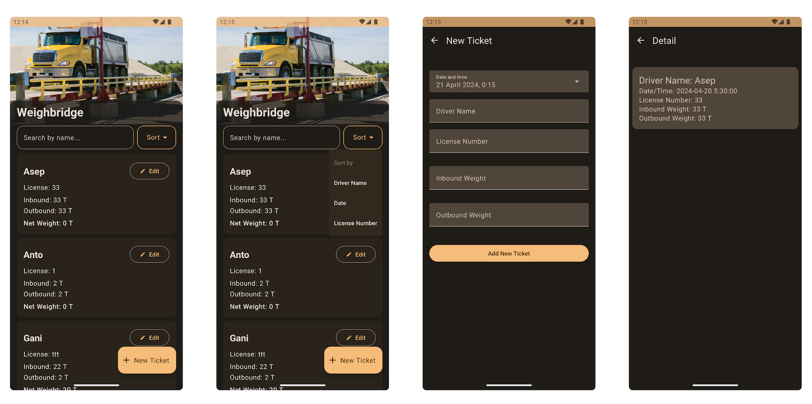
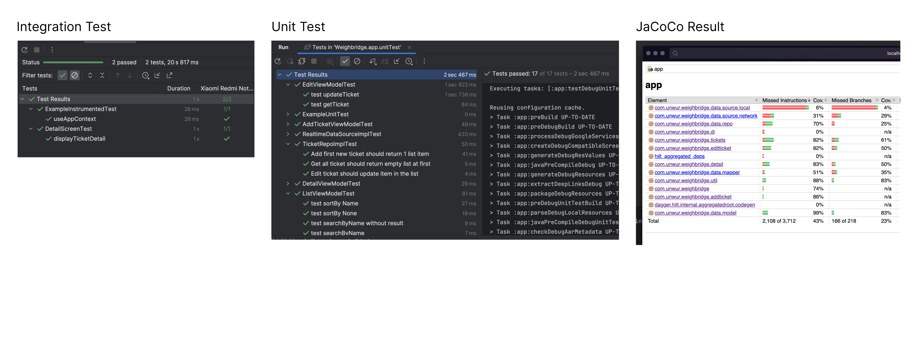

# Weighbridge

Test Result:

Project includes:
- Firebase Realtime Database
- Jetpack Room
- Jetpack Compose
- JaCoCo Code Coverage

Due to the security and convenience, instead of create a private repository and invite your email to the repository, I will share the project code as a zip here.

To test the project:
- Clone project
- Open the location.
- Run command "./gradlew build" and "./gradlew test" or open in Android Studio

Note:
- In order to project to works in Android, please add your Firebase project version.add "app/google-services.json" file with your Firebase project version.

